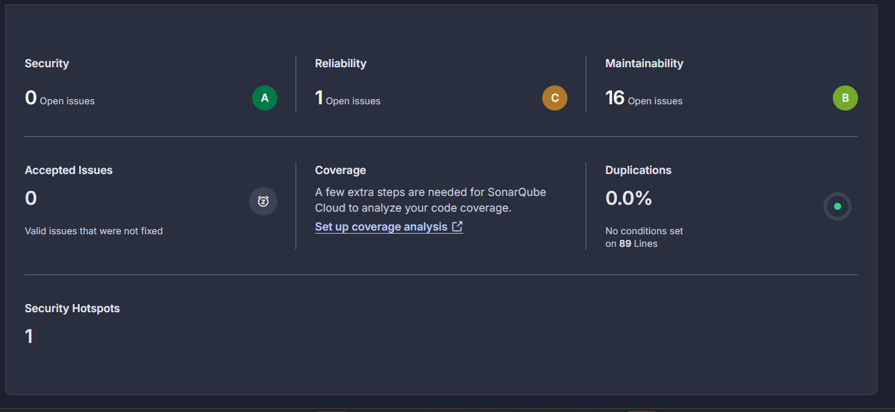
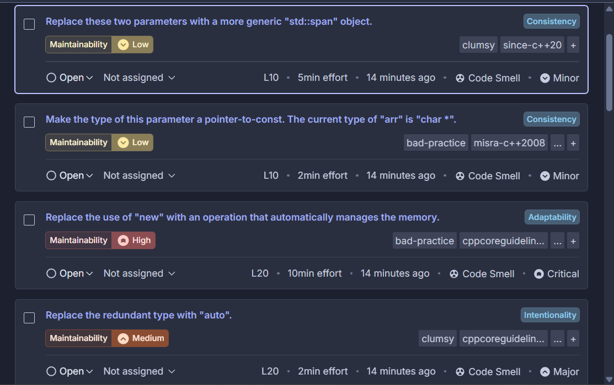
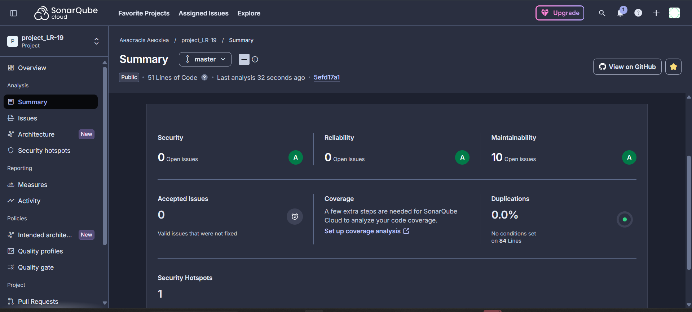

# Лабораторна робота  
## Інтеграція SonarQube Cloud у курсовий проєкт для автоматизованої перевірки якості та безпеки коду

---

## Мета роботи
Навчитися інтегрувати інструмент автоматизованого аналізу коду SonarQube Cloud у власний проєкт, виконувати перевірку якості та безпеки коду, аналізувати результати сканування та визначати напрями покращення в межах підходу DevSecOps.

---

## Короткий опис проєкту
У межах лабораторної роботи використано консольний проєкт на C++, який генерує масив символів та сортує його алгоритмом **merge sort**. Початкова версія коду використовувала:
- статичні масиви;
- ручне виділення пам’яті (`new/delete`);
- функцію `rand()` для генерації випадкових значень.

Після аналізу SonarQube код був рефакторений із використанням сучасних підходів C++ (STL, `<random>`, безпечне керування пам’яттю).

---

## Підключення SonarQube Cloud
1. Створено обліковий запис у **SonarQube Cloud**.
2. Імпортовано GitHub репозиторій із проєктом.
3. Налаштовано автоматичний аналіз коду.
4. Запущено перше сканування проєкту.

---

## Початковий результат аналізу
Після першого запуску SonarQube було виявлено **16 проблем**, серед яких:
- Code Smells
- Bugs
- Maintainability issues
  


Основні зауваження:
- використання `rand()` замість `<random>`;
- використання сирих вказівників (`new/delete`);
- можливі проблеми з керуванням пам’яттю;
- не оптимальні сигнатури функцій;
- стильові проблеми оголошення змінних.

---

## Виявлені категорії проблем
- **Code Smells** – більшість зауважень (стиль, структура коду)
- **Maintainability** – складність підтримки старого підходу
- **Bugs (потенційні)** – ризики витоків пам’яті через `new/delete`
- **Security Hotspots / Vulnerabilities** – не виявлено критичних проблем


---

## Виправлення коду

### 1. Заміна масиву на `vector`
**Було:**
```cpp
char arr[10];
````

**Стало:**

```cpp
vector<char> arr(size);
```

---

### 2. Видалено ручне керування пам’яттю

**Було:**

```cpp
char* L = new char[n1];
char* R = new char[n2];
```

**Стало:**

```cpp
vector<char> L(...);
vector<char> R(...);
```

---

### 3. Заміна `rand()` на `<random>`

**Було:**

```cpp
arr[i] = 'A' + rand() % 26;
```

**Стало:**

```cpp
random_device rd;
mt19937 gen(rd());
uniform_int_distribution<int> dist(0, 25);

arr[i] = 'A' + dist(gen);
```

---

### 4. Покращення стилю коду

* Розділено оголошення змінних:

```cpp
int i = 0;
int j = 0;
int k = left;
```

---

### 5. Використання `const`

**Було:**

```cpp
void printArray(vector<char>& arr)
```

**Стало:**

```cpp
void printArray(const vector<char>& arr)
```

---

## Повторне сканування SonarQube

Після внесення змін було виконано повторний аналіз:

* кількість проблем зменшилась з **16 до 10**
* зникли критичні зауваження щодо пам’яті
* покращилась maintainability оцінка
* код став більш безпечним і сучасним


---

## Фінальна версія коду

```cpp
#include <iostream>
#include <vector>
#include <random>
#include <locale>

using namespace std;

void printArray(const vector<char>& arr) {
    for (char c : arr)
        cout << c << " ";
    cout << endl;
}

void merge(vector<char>& arr, int left, int mid, int right) {
    vector<char> L(arr.begin() + left, arr.begin() + mid + 1);
    vector<char> R(arr.begin() + mid + 1, arr.begin() + right + 1);

    int i = 0, j = 0, k = left;

    while (i < L.size() && j < R.size()) {
        if (L[i] <= R[j])
            arr[k++] = L[i++];
        else
            arr[k++] = R[j++];
    }

    while (i < L.size())
        arr[k++] = L[i++];

    while (j < R.size())
        arr[k++] = R[j++];
}

void mergeSort(vector<char>& arr, int left, int right) {
    if (left < right) {
        int mid = left + (right - left) / 2;

        mergeSort(arr, left, mid);
        mergeSort(arr, mid + 1, right);

        merge(arr, left, mid, right);
    }
}

int main() {
    setlocale(LC_ALL, "ukr");

    const int size = 10;
    vector<char> arr(size);

    random_device rd;
    mt19937 gen(rd());
    uniform_int_distribution<int> dist(0, 25);

    for (int i = 0; i < size; i++)
        arr[i] = 'A' + dist(gen);

    cout << "Початковий масив: ";
    printArray(arr);

    mergeSort(arr, 0, size - 1);

    cout << "Відсортований масив: ";
    printArray(arr);

    return 0;
}
```

---

## Висновок

У ході лабораторної роботи було виконано інтеграцію SonarQube Cloud у навчальний проєкт. Інструмент дозволив автоматично виявити проблеми якості та потенційні ризики безпеки коду.

Після аналізу було проведено рефакторинг коду, зокрема замінено застарілі підходи (масиви, `new/delete`, `rand()`) на сучасні можливості C++ STL та `<random>`.

Результати повторного аналізу показали покращення якості коду та зменшення кількості зауважень.

Автоматизований аналіз коду є важливою частиною підходу **DevSecOps**, оскільки дозволяє знаходити помилки ще на етапі розробки, підвищуючи безпеку, стабільність і підтримуваність програмного забезпечення.

---

